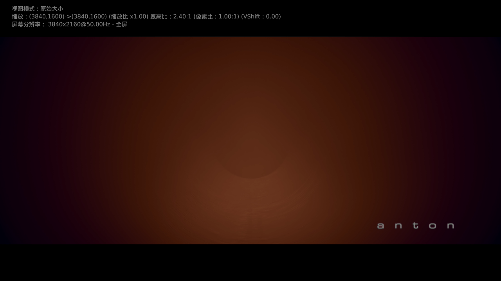
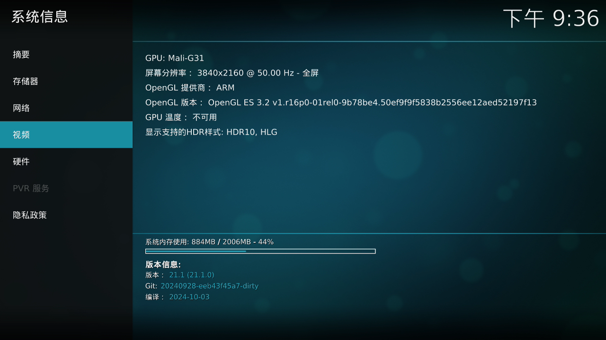
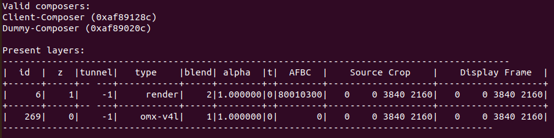
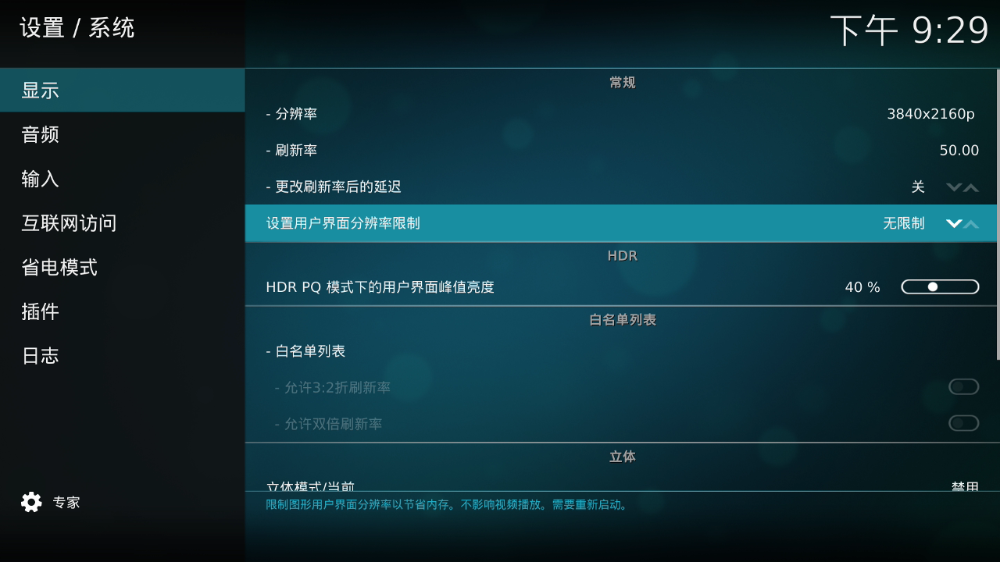

# Kodi_for_S905L3A
 Kodi for S905L3A Android 9

**基于Amlogic S905L3A芯片的机顶盒的Kodi App。**
* * *
## 支持的型号
unt403a，unt413a ，
e900v22c，e900v22d
b863av3.1，b863av3.2
cm311-1a，cm311-1sa，m401a
unp-sja5
* * *
## 主要特性
4K GUI
视频真4K输出
* * *
## 捐赠码

## 实际效果

* * *
## 配置

- 列表项将【设置用户界面分辨率限制】设定为【无限制】。

- 列表项缓存的Read Factor设置为【4x】，S905L3A为4核CPU，不建议大于4x。

- 列表项如果码率大于80m，必须外接USB千兆网卡。
